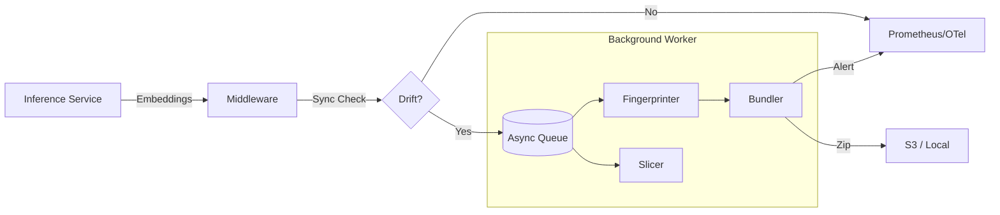

# Vision Incident Response Kit (VIRK)

<div align="center">

[](https://opensource.org/licenses/MIT)
[](https://www.python.org/downloads/)
[](https://github.com/krishna-dhulipalla/Vision-Incident-Response-Kit--VIRK-)

**Production diagnostics for vision model failures.**

</div>

VIRK is a lightweight "flight recorder" for computer vision pipelines. It sits alongside your inference service, detects conceptual drift (blur, lighting, camera shifts), diagnoses the root cause, and automatically bundles "incident packs" for reproducible debugging.

## Architecture



## Key Features

- **Scalable Drift Detection**: Uses RBF MMD with subsampling. Complexity is **O(k^2)** (where k=subsample size, e.g. 1000), and O(1) relative to total stream volume N.
- **Async & Non-Blocking**: Heavy diagnostics (fingerprinting, bundling) run in a single background worker thread (default queue size=100). If the queue fills under load, new drift events are dropped (load shedding) to protect inference latency.
- **Cause Fingerprinting**: Tells you _why_ it failed (e.g., "Motion Blur detected", "Brightness shift").
- **Incident Bundler**: Automatically creates zip bundles with images, metadata, and a replay script for local reproduction.

## Installation

```bash
git clone https://github.com/krishna-dhulipalla/Vision-Incident-Response-Kit--VIRK-.git
cd Vision-Incident-Response-Kit--VIRK-
pip install -e .
```

### Optional Dependencies

- **S3 Storage**: `pip install -e .[s3]`
- **Prometheus**: `pip install -e .[prometheus]`
- **OpenTelemetry**: `pip install -e .[otel]`

## Integration Guide

### 1. The Easy Way: `VirkMiddleware.create()`

Wrap your prediction logic with our middleware. The `create()` factory uses sensible defaults.

```python
from virk.integration.middleware import VirkMiddleware

# 1. Initialize (One Line)
# Note: 'extractor' must implement .extract(List[Union[str, PIL.Image, np.ndarray]]) -> np.ndarray (EmbeddingExtractor-compatible).
monitor = VirkMiddleware.create(
    reference_embeddings=ref_data,  # Your training/baseline embeddings
    extractor=model,                 # Feature extractor (e.g. TIMM model interface)
    output_dir="/tmp/bundles",       # Where to save incidents
    metrics_type="prometheus",       # 'prometheus', 'otel', or 'none'. OTel falls back to Prom if missing, then NoOp.
    async_processing=True            # Run heavy tasks in background
)

# 2. Inside your inference loop
def predict(images):
    embeddings = model.encode(images)

    #  Hook! (Non-blocking)
    monitor.process_batch(
        embeddings=embeddings,
        image_paths=[img.path for img in images],
        metadata=[{"cam": img.cam_id} for img in images]
    )
```

### 2. Calibration (FPR Targeting)

Don't guess your drift threshold. Use `calibrate` to find a threshold that guarantees a specific False Positive Rate (e.g., 5%) on your clean data.

```bash
virk calibrate --dataset path/to/clean_data --fpr 0.05
```

**Output:**

```text
==================================================
 VIRK THRESHOLD CALIBRATION
==================================================
Target FPR:          5.0%
Max Clean Score:     0.0421
--------------------------------------------------
RECOMMENDED THRESHOLD: 0.038512
==================================================
```

## Demo Service

VIRK comes with a production-ready demo service you can run immediately:

```bash
# Runs uvicorn with the demo app
virk demo-prod --port 8080
```

## CLI Tools

### Incident Summary

Instant Root Cause Analysis (RCA) on a captured bundle:

```bash
virk incident summarize incident_1234abcd.zip
```

## Trust & Reliability

VIRK is designed for high-assurance production environments.

### 1. Reproducibility Guarantees

Every incident bundle is a **self-contained reproduction kit**:

- **Manifest Schema v1.0.0**: Strict schema versioning ensures downstream compatibility.
- **Environment Capture**: Includes `requirements.txt` (pip freeze) to match dependency versions.
- **Determinism**: Replay script enforces seed `42` for consistent debugging.

### 2. Failure Modes & Load Shedding

We prioritize **Inference Latency** over diagnostics.

- **Normal Operation**: Analysis runs in a background thread.
- **Overload (Queue Full)**: If the background worker falls behind (>100 items), new drift events are **dropped**.
- **Metrics**: Drop events are logged as warnings and can be monitored via metrics (planned).

### 3. Verified Datasets

VIRK is benchmarked against strict FPR targets on:

- **CIFAR-10** (General Object Recognition)
- **Flowers-102** (Fine-grained Classification)

### Benchmarking

Verify VIRK's performance on standard datasets:

```bash
virk eval --dataset-name cifar10
```

## Contributing

Running tests:

```bash
pytest tests/
```
