<div align="center">

# Vision Incident Response Kit (VIRK)

[](https://opensource.org/licenses/MIT)
[](https://www.python.org/downloads/)
[](https://github.com/krishna-dhulipalla/Vision-Incident-Response-Kit--VIRK-)

[](https://github.com/krishna-dhulipalla/Vision-Incident-Response-Kit--VIRK-)
[](https://github.com/krishna-dhulipalla/Vision-Incident-Response-Kit--VIRK-)
[](https://github.com/krishna-dhulipalla/Vision-Incident-Response-Kit--VIRK-)
[](https://github.com/krishna-dhulipalla/Vision-Incident-Response-Kit--VIRK-)

### Production incident response and drift forensics for vision models

</div>

VIRK is a lightweight flight recorder for vision pipelines. It runs alongside inference, detects distribution drift (blur, lighting, camera shifts), attributes likely causes, and bundles reproducible incident packs for debugging.

## Architecture

<div align="center">

<a href="docs/architecture.svg">
  
</a>

</div>

To regenerate the diagram:

```bash
powershell -ExecutionPolicy Bypass -File scripts/render_mermaid.ps1
```

## Why VIRK

- **Incident-first**: Focused on diagnosing failures, not building a full observability platform.
- **Reproducible**: Bundles the exact evidence needed to replay and debug an incident.
- **Actionable**: Points to likely causes (blur, brightness, noise) and affected slices.
- **Low friction**: Designed to sit alongside inference with minimal integration overhead.

## Key Features

- **Scalable Drift Detection**: Uses RBF MMD with subsampling. Complexity is **O(k^2)** (where k=subsample size, e.g. 1000), and O(1) relative to total stream volume N.
- **Async & Non-Blocking**: Heavy diagnostics (fingerprinting, bundling) run in a single background worker thread (default queue size=100). If the queue fills under load, new drift events are dropped (load shedding) to protect inference latency.
- **Cause Fingerprinting**: Tells you _why_ it failed (e.g., "Motion Blur detected", "Brightness shift").
- **Incident Bundler**: Automatically creates zip bundles with images, metadata, and a replay script for local reproduction.

## Installation

```bash
git clone https://github.com/krishna-dhulipalla/Vision-Incident-Response-Kit--VIRK-.git
cd Vision-Incident-Response-Kit--VIRK-
pip install -e .
```

### Optional Dependencies

- **S3 Storage**: `pip install -e .[s3]`
- **Prometheus**: `pip install -e .[prometheus]`
- **OpenTelemetry**: `pip install -e .[otel]`

## Integration Guide

### 1. The Easy Way: `VirkMiddleware.create()`

Wrap your prediction logic with our middleware. The `create()` factory uses sensible defaults.

```python
from virk.integration.middleware import VirkMiddleware

# 1. Initialize (One Line)
# Note: 'extractor' must implement .extract(List[Union[str, PIL.Image, np.ndarray]]) -> np.ndarray (EmbeddingExtractor-compatible).
monitor = VirkMiddleware.create(
    reference_embeddings=ref_data,  # Your training/baseline embeddings
    extractor=model,                 # Feature extractor (e.g. TIMM model interface)
    output_dir="/tmp/bundles",       # Where to save incidents
    metrics_type="prometheus",       # 'prometheus', 'otel', or 'none'. OTel falls back to Prom if missing, then NoOp.
    async_processing=True            # Run heavy tasks in background
)

# 2. Inside your inference loop
def predict(images):
    embeddings = model.encode(images)

    #  Hook! (Non-blocking)
    monitor.process_batch(
        embeddings=embeddings,
        image_paths=[img.path for img in images],
        metadata=[{"cam": img.cam_id} for img in images]
    )
```

### 2. Calibration (FPR Targeting)

Don't guess your drift threshold. Use `calibrate` to find a threshold that guarantees a specific False Positive Rate (e.g., 5%) on your clean data.

```bash
virk calibrate --dataset path/to/clean_data --fpr 0.05
```

**Output:**

```text
==================================================
 VIRK THRESHOLD CALIBRATION
==================================================
Target FPR:          5.0%
Max Clean Score:     0.0421
--------------------------------------------------
RECOMMENDED THRESHOLD: 0.038512
==================================================
```

## Demo Service

VIRK comes with a production-ready demo service you can run immediately:

```bash
# Runs uvicorn with the demo app
virk demo-prod --port 8080
```

## Integrations

Popular library examples (optional dependencies):

- YOLOv8: `examples/yolo_integration.py`
- Hugging Face ViT: `examples/hf_vit_integration.py`

Quick start:

```bash
# YOLOv8 example
pip install ultralytics torch torchvision
python examples/yolo_integration.py

# Hugging Face ViT example
pip install transformers torch torchvision
python examples/hf_vit_integration.py
```

## CLI Tools

### Incident Summary

Instant Root Cause Analysis (RCA) on a captured bundle:

```bash
virk incident summarize incident_1234abcd.zip
```

## Trust & Reliability

VIRK is explicit about what it records and what it does not. The goal is transparent, reproducible debugging rather than black-box monitoring.

### Reproducibility

- Incident bundles include `manifest.json`, a `bundle_version` field, and a data hash over the bundled images.
- Bundles include a replay script that fixes random seeds for deterministic inspection.
- Bundles are capped at 20 images by default to keep artifacts small.

### Failure Modes & Load Shedding

- Drift detection runs inline; diagnostics (fingerprinting, slicing, bundling) run in a background worker.
- If the queue is full, new drift events are dropped and a warning is logged.

### Evidence & Evaluation

- The evaluation harness supports CIFAR-10 and Flowers-102 via `virk eval`.
- Use `virk calibrate` to set thresholds to a target false positive rate on clean data.

### Benchmarking

Verify VIRK's performance on standard datasets:

```bash
virk eval --dataset-name cifar10
```

## Contributing & Collaboration

We welcome contributions!

- **Found a bug?** Open an issue.
- **Building something similar?** If you're working on vision reliability tools, ping me! Let's work together.

Running tests:

```bash
pytest tests/
```
